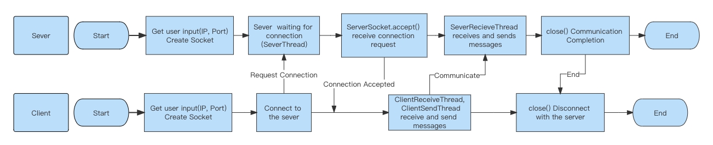

# P2P-ChatSystem-Distributed-System

##Introduction
This project implements a Peer-to-Peer (P2P) chat system using Java. The project has already implemented the following features.

➀ The server supports multiple client connections.

➁ Each time a client connects or disconnects to the server the event is announced to all
connected clients.

➂ Server and client can perform the following operations:\
(a) The Client can send a text to all the other clients connected to the server by either clicking the button on the UI or using the command\
(b) The client can send a text to the client with the given ID directly as a P2P connection by either clicking the button or using the command\
(c) The client can force the server to close the connection and announce to all other clients by either clicking the logout button or using the command\
(d) The server can get a list of all client IDs currently connected to the server by either clicking the button or using the command\
(e) Sever can close the connection with the IP client, and also announces this to all clients by clicking the kick button or using the command\
(f) The server can get a list of all commands used by the client identified by the ID by using the command\

##Flowchart
This flowchart shows the flow of the server and client sides of the project from Start to End and the logic of how I realize the communication between them. Figure 4 shows the Project Flowchart of this project.

##Server Side
➀ When the server is started, a socket is created based on the IP address and port number entered by the user. The server waits for a TCP connection request from the client. Once the connection request is captured with ServerSocket.accept(), a thread will be assigned to that TCP connection. (Sever.java)\
➁ When a user logout or is kicked by the sever, a message is sent to all clients and the user list is updated (severRecievethread.java).\
➂ Sever gets all connected clients and can display them in the chatting box (sever.java)\
➃ The server automatically gets the username, IP address and port number of the client after the user connects, and also updates the list of all online users. (sever.java)\
➄ Sever gets all the commands entered by each client and can display them in a dialog box (severRecievethread.java)

##Client Side
➀ The user logs in by entering the ip address and port number, after which the client sends a socket connection request to the server. Once a successful response to the connection request is received from the server, the client allocates a message receiving thread to this socket. (client.java)\
➁ Once the user is logged in, a socket is created to wait for other users to request a chat. Each client also acts as a server to receive chat requests from other users while they are chatting. (ClientReceiveThread)\
➂ When the user logs in they receive a list of all online users from the server and the user can select specific users to chat with. (clientSendThread)\
➃ The client can choose to send a group chat by establishing a connection with all other online clients and sending messages to them at the same time. (client.java)\
➄ Store all the commands used by the client in an ArrayList and send it to the sever\
➅ After the client logout or is kicked, remove the client from the user list and send offline messages to the sever and other clients\